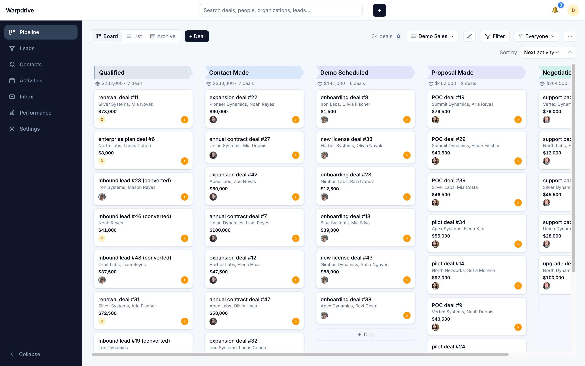
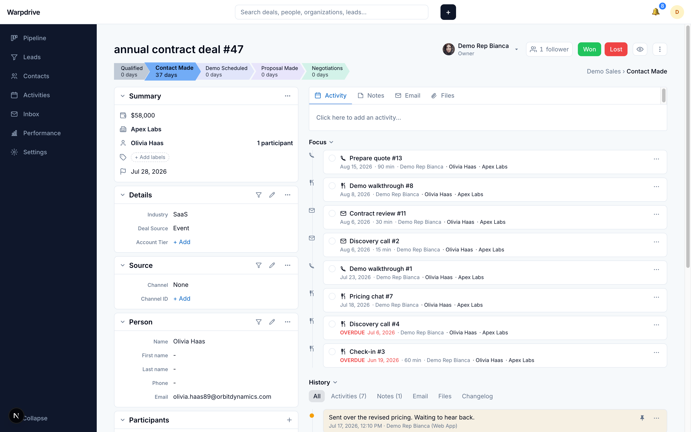
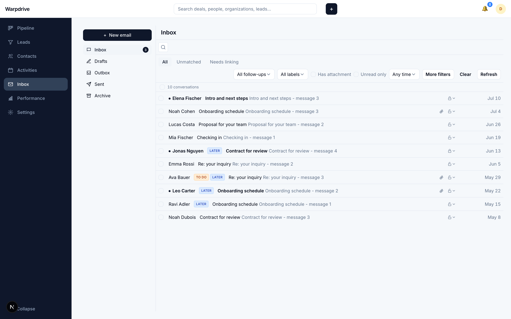
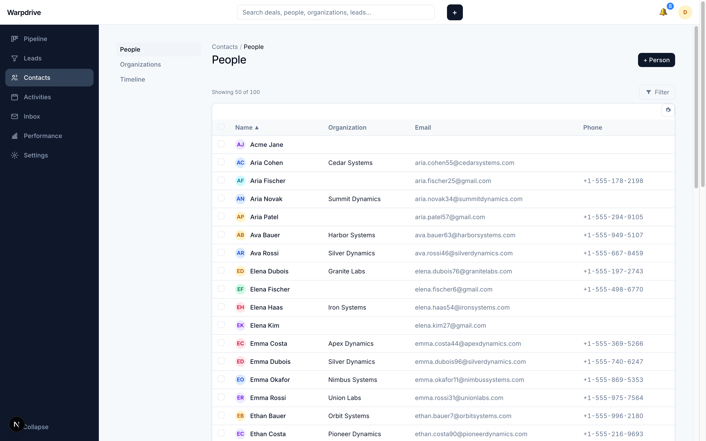

<h1 align="center">warpdrive</h1>

<p align="center">
  An open-source, self-hosted <b>Pipedrive alternative</b> for business-development teams.<br/>
  Pipeline management, a deal workspace, contacts, and two-way Gmail, running entirely on your own infrastructure.
</p>

<p align="center">
  <a href="LICENSE"></a>
  
  
  
  
</p>

<p align="center">
  
</p>

warpdrive reimplements the core business-development workflow of Pipedrive as software you
run yourself. It is **single-tenant and self-hosted**: your own box, your own Postgres and
object storage, authenticated with your own Google Workspace. Your customer data never
leaves your infrastructure, and there is no per-seat bill.

The information architecture and workflows follow the tools BD teams already know, but all
code, styling, and assets are original, and the interface ships its own visual layer built
on [shadcn/ui](https://ui.shadcn.com). warpdrive is not affiliated with or endorsed by
Pipedrive.

## Contents

- [Features](#features)
- [Screenshots](#screenshots)
- [warpdrive vs Pipedrive](#warpdrive-vs-pipedrive)
- [Tech stack](#tech-stack)
- [Quickstart (local development)](#quickstart-local-development)
- [Self-hosting](#self-hosting)
- [Tests](#tests)
- [Project status](#project-status)
- [Contributing](#contributing)
- [License](#license)

## Features

**Pipeline**
- Kanban board with drag-and-drop stages, multiple pipelines, and custom stages
- Per-stage weighted totals, rotting-deal indicators, and saved filters
- Board / list / archive views

**Deals**
- Deal workspace with a unified timeline: activities, notes, files, email, and full change history
- Participants, followers, labels, lost reasons, and close dates
- Won / lost handling with a stage-progress bar

**Contacts**
- People and organizations with custom fields (JSONB)
- Organization firmographics and org-to-org relationships
- Leads inbox and CSV import with an undo step

**Email (two-way Gmail)**
- Send and receive over the Gmail API, with thread linking to deals and people
- Open and click tracking, templates, signatures, merge fields, and scheduled send
- Personal inbox plus shared, deal- and contact-linked threads

**Team and platform**
- Role-based permissions, teams, and user management
- Notifications and basic pipeline stats (funnel, deal and activity performance)
- Realtime updates across the board, inbox, notifications, and presence over WebSocket

## Screenshots

**Deal workspace:** activities, notes, files, and the full history timeline in one view.



**Inbox:** two-way Gmail with thread linking, follow-up labels, and unread state.



**Contacts:** people and organizations with custom fields.



## warpdrive vs Pipedrive

warpdrive covers Pipedrive's core BD loop and deliberately leaves the rest out of scope. The
goal is a focused, self-hosted CRM, not a feature-for-feature clone.

|  | warpdrive | Pipedrive |
|---|:---:|:---:|
| License | MIT, open source | Proprietary |
| Hosting | Self-hosted, single-tenant | Vendor cloud |
| Pricing | Free (your infrastructure only) | Paid, per seat |
| Your data | Stays on your infrastructure | Vendor servers |
| Kanban pipeline + custom stages | ✅ | ✅ |
| Multiple pipelines | ✅ | ✅ |
| Deal workspace (activities, notes, files, history) | ✅ | ✅ |
| Contacts and organizations + custom fields | ✅ | ✅ |
| Leads inbox + CSV import (with undo) | ✅ | ✅ |
| Two-way Gmail (send/receive, threads, open/click tracking) | ✅ | ✅ |
| Email templates, signatures, scheduled send | ✅ | ✅ |
| Permissions, teams, user management | ✅ | ✅ |
| Saved filters | ✅ | ✅ |
| Realtime board / inbox / presence | ✅ | ✅ |
| Notifications | ✅ | ✅ |
| Pipeline stats (funnel, performance) | ✅ Basic | ✅ Advanced |
| Products, Projects, Invoicing, Forecast | ➖ Out of scope | ✅ |
| Multi-currency | ➖ Out of scope | ✅ |
| Workflow automation | ➖ Email scheduling only | ✅ |
| Web forms / chatbot / marketplace | ➖ Out of scope | ✅ |
| Native mobile apps | ➖ Web app | ✅ |

✅ supported · ➖ intentionally out of scope

## Tech stack

Next.js (App Router) and React with TypeScript, Drizzle ORM on Postgres, tRPC with TanStack
Query, Next server actions, shadcn/ui with Tailwind, dnd-kit for the board, Zustand for
board-local state, a self-hosted WebSocket server backed by Postgres LISTEN/NOTIFY, MinIO
(or any S3-compatible store) for files, and the Gmail API via Google OAuth. Package manager:
pnpm.

## Quickstart (local development)

Requires Node, pnpm, and Docker.

```bash
pnpm install
cp .env.example .env
# bring up Postgres and MinIO with host ports and no TLS:
docker compose -f docker-compose.yml -f docker-compose.dev.yml up -d postgres minio
pnpm db:migrate
pnpm dev
```

The app runs at `http://localhost:3000`. Google sign-in and Gmail need an OAuth client (see
[`docs/deploy.md`](docs/deploy.md)); for local exploration you can sign in without Google
using the dev-login route.

## Self-hosting

The repo ships a single-box Docker topology (app, WebSocket server, background worker,
Postgres, MinIO, and Caddy for automatic HTTPS):

```bash
cp .env.example .env    # fill in domain, Google OAuth, storage, and secrets
docker compose up -d --build
```

Caddy provisions TLS for your domain automatically; Postgres and MinIO stay on the internal
network. See [`docs/deploy.md`](docs/deploy.md) for the full guide, including Google OAuth
setup, the `s3.` subdomain for file uploads, and every required environment variable.

## Tests

```bash
pnpm test:unit          # fast unit tests
pnpm test:integration   # spins up a disposable Postgres via Testcontainers
```

Integration tests run against a real Postgres (never a mock) so migrations and queries are
exercised as they run in production.

## Project status

warpdrive is used in production for a single team's BD workflow and is actively developed.
The features listed above are built and working. The out-of-scope rows in the comparison
table are deliberate and not on the near-term roadmap; the focus is depth and polish on the
core pipeline, deal, contact, and email surfaces.

## Contributing

Issues and pull requests are welcome. PRs are reviewed and merged upstream, then land back
here on the next release. Please keep changes focused and include tests for new behavior.

## License

MIT. See [`LICENSE`](LICENSE).
